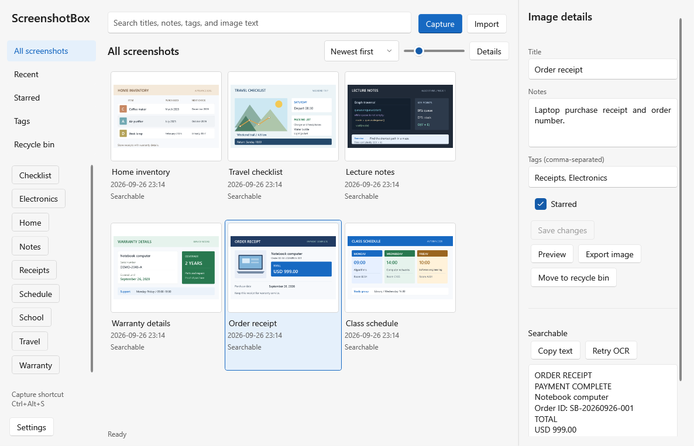
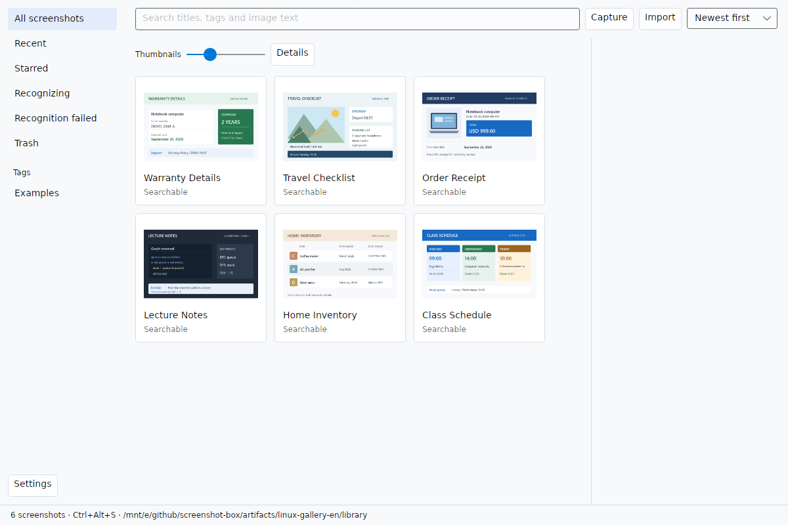
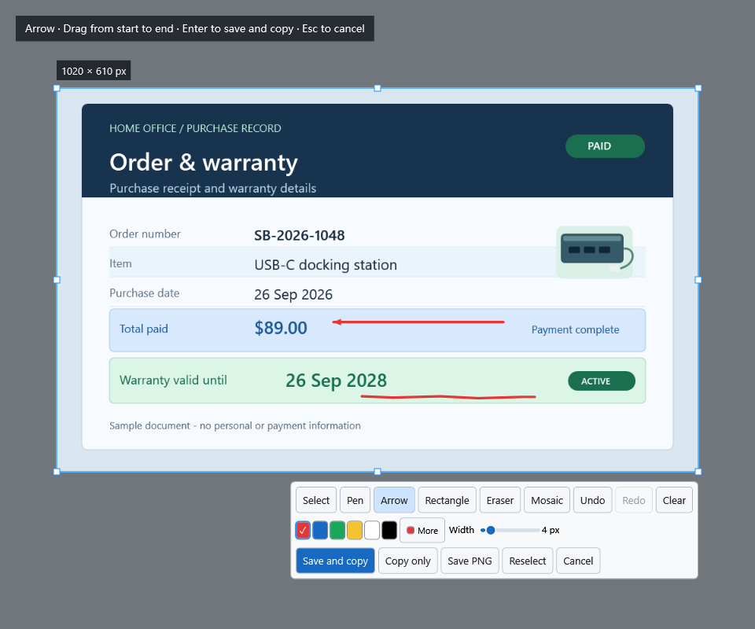
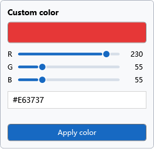
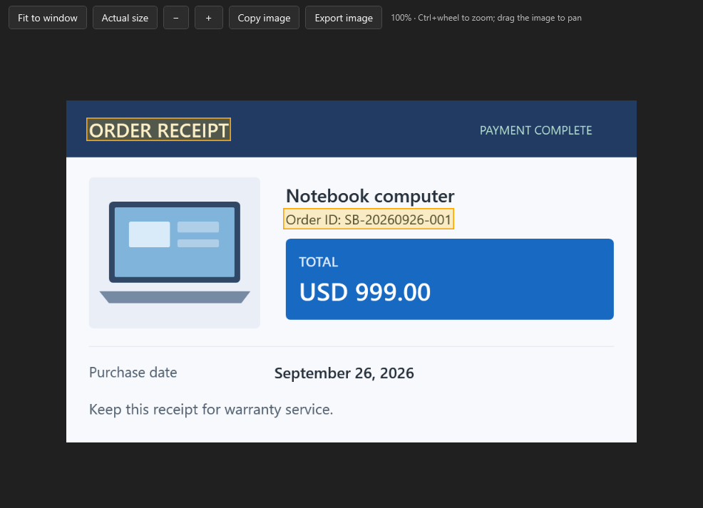
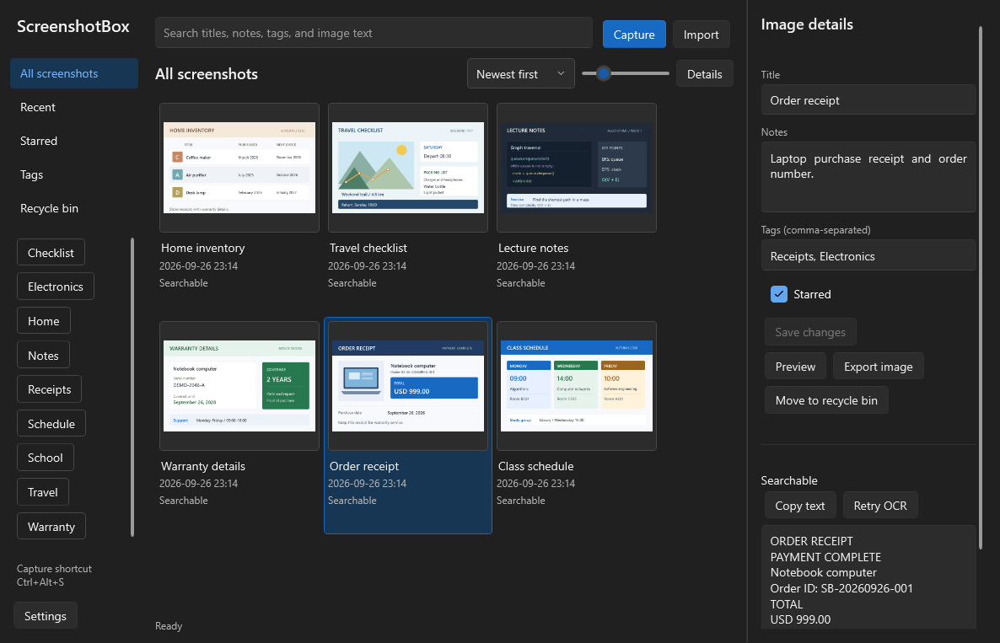

<div align="center">


# ScreenshotBox

**Save screenshots locally. Find them by their text.**

[English](README.md) · [简体中文](README.zh-CN.md)

[](https://github.com/liugedragon/screenshot-box/actions/workflows/windows.yml)
[](https://github.com/liugedragon/screenshot-box/releases)
[](LICENSE)

[**Download installer**](https://github.com/liugedragon/screenshot-box/releases/download/v0.1.4/ScreenshotBox-0.1.4-win-x64-setup.exe) · [**Download ZIP**](https://github.com/liugedragon/screenshot-box/releases/download/v0.1.4/ScreenshotBox-0.1.4-win-x64.zip) · [User guide](docs/usage.md) · [Report a problem](https://github.com/liugedragon/screenshot-box/issues/new/choose)

</div>

ScreenshotBox is a screenshot tool and local image library. Select a screen region with a hotkey and save it; text recognition runs in the background. Later, search by title, notes, tags, or text in the image. Class schedules, order numbers, and warranty dates stay on your computer.

For **Windows 11 x64**. No account, API key, Python, or dedicated GPU required. OCR runs locally on the CPU with bundled models. **0.1.4 is a prerelease**; see [known limitations](docs/limitations.md) for current issues and untested configurations.



*Version 0.1.3, with English sample documents and metadata. All sample content is synthetic. The interface follows the Windows display language: Chinese for Chinese display languages, English for all others. Choose System, 简体中文, or English in Settings; restart to apply.*

## Get started

1. Press **Ctrl+Alt+S** and drag a selection. Move it or resize it with eight handles, then add a pen stroke, arrow, rectangle, or mosaic if needed.
2. Press **Enter** to save and copy, then return to your previous app. The image is saved immediately; OCR runs in the background.
3. Open the library from the tray and search for a word in the screenshot. Select an image and press **Space** to preview it with matching text lines highlighted.

You can change the capture hotkey to `Alt+A`, `Ctrl+Shift+Q`, or another combination. The app checks common reserved system shortcuts and global hotkey availability; failed registration leaves the old hotkey active. **Esc** cancels without creating an image or entry.

## Ubuntu / X11 preview

An experimental Ubuntu x64 version is available separately from the Windows release. It includes region capture, annotation, local Chinese/English OCR, search and library backups. It currently requires X11; tray integration and login startup are not included.

[Download Linux preview](https://github.com/liugedragon/screenshot-box/releases/download/v0.1.5-linux.1/ScreenshotBox-0.1.5-linux.1-linux-x64.tar.gz) · [Linux guide and test coverage](docs/linux.md)



*Linux 0.1.5-linux.1, running under WSL Ubuntu with XLaunch. Sample images are synthetic. The Windows feature list follows below; Linux differences are described in its guide.*

## Features

| Feature | Details |
| --- | --- |
| Capture and copy | Region selection, movement, eight resize handles; save and copy, copy only, or save as PNG. |
| Annotation | Pen, arrow, outline rectangle, eraser, mosaic; adjustable sizes, RGB/Hex palette, undo and redo. |
| Text search | Titles, notes, tags, and OCR text; short Chinese phrases, mixed text, dates, and IDs. |
| Organization | Import PNG/JPEG, add tags, notes, and stars; restore deleted items from the recycle bin. |
| Image preview | Zoom, pan, fit to window, or actual pixel size; whole-line OCR match highlights. |
| Local library | Custom library location, ZIP backup and restore. |
| Appearance and language | System, light, and dark themes; System, Simplified Chinese, or English. |

<details>
<summary>Capture tools, text search, and dark theme</summary>









More screenshots are in the [UI inspection record](docs/ui-review.md).

</details>

## Installation and data

- **Installer**: choose an installation folder; Start menu and uninstall entries are created. From 0.1.4, Start in the tray when I sign in to Windows is selected by default; clear it during installation to opt out.
- **ZIP**: extract the complete directory and run `ScreenshotBox.exe`. Portable use does not add a Windows startup entry.

Packages are approximately 84.0 MiB for the installer and 108.5 MiB for the ZIP. Both include the .NET runtime, native libraries, and OCR models. Keep the complete directory together. Checksums are on the [release page](https://github.com/liugedragon/screenshot-box/releases/tag/v0.1.4). Exit the old version from the tray before upgrading.

After installing 0.1.4, sign-in startup runs quietly in the tray with the capture shortcut active. Open the library from the tray. To disable or re-enable it, use Task Manager → Startup apps → ScreenshotBox. The app does not change a disabled startup setting.

The library defaults to `%LOCALAPPDATA%\ScreenshotBox\library`, separate from the installation. Settings can move it to another folder while retaining the original. The app does not upload images or text, or download models during recognition. Uninstalling preserves your library. Closing the main window leaves the app in the tray; use its menu to quit completely.

OCR may misread low-resolution, handwritten, or busy images. Mosaic is visual pixelation, not secure redaction; erasing it restores the original pixels. Scrolling capture, recording, cloud sync, automatic updates, and editing annotations after saving are not supported. The app and installer are unsigned. Test environments and results are in the [validation record](docs/validation.md).

## Documentation and development

| Guide | Contents |
| --- | --- |
| [User guide](docs/usage.md) | Capture, annotation, search, organization, backups, and settings. |
| [Build](docs/build.md) · [Packaging and installation](docs/distribution.md) | Run from source, create a ZIP or installer. |
| [Architecture](docs/architecture.md) · [Storage and search](docs/storage.md) | Coordinates, queries, background jobs, and recovery. |
| [Design](docs/design.md) · [UI inspection](docs/ui-review.md) | References, styles, and layout records. |
| [Tests](docs/validation.md) · [Limitations](docs/limitations.md) | Test results and supported conditions. |
| [Third-party components](docs/third-party.md) | Components, models, versions, licenses, and hashes. |

Requires Windows x64 and **.NET SDK 10.0.401**. Run from the repository root:

```powershell
powershell -ExecutionPolicy Bypass -File scripts/fetch-models.ps1
powershell -ExecutionPolicy Bypass -File scripts/build.ps1
powershell -ExecutionPolicy Bypass -File scripts/package.ps1 -Version 0.1.4
```

The first model download requires a connection. Dependencies are pinned in `packages.lock.json`; building an installer requires Inno Setup.

See [CONTRIBUTING](CONTRIBUTING.md) for bug reports, documentation fixes, and code contributions, and [ROADMAP](ROADMAP.md) for planned features. If you find the app useful, a Star is welcome.

## License

Application code and the original icon use [MIT](LICENSE). WPF UI, RapidOcrNet, PaddleOCR models, ONNX Runtime, SQLite, and other components retain their own licenses; see [third-party notices](docs/third-party.md). Layout references include Eagle, ShareX, and PowerToys; see the [design notes](docs/design.md).
