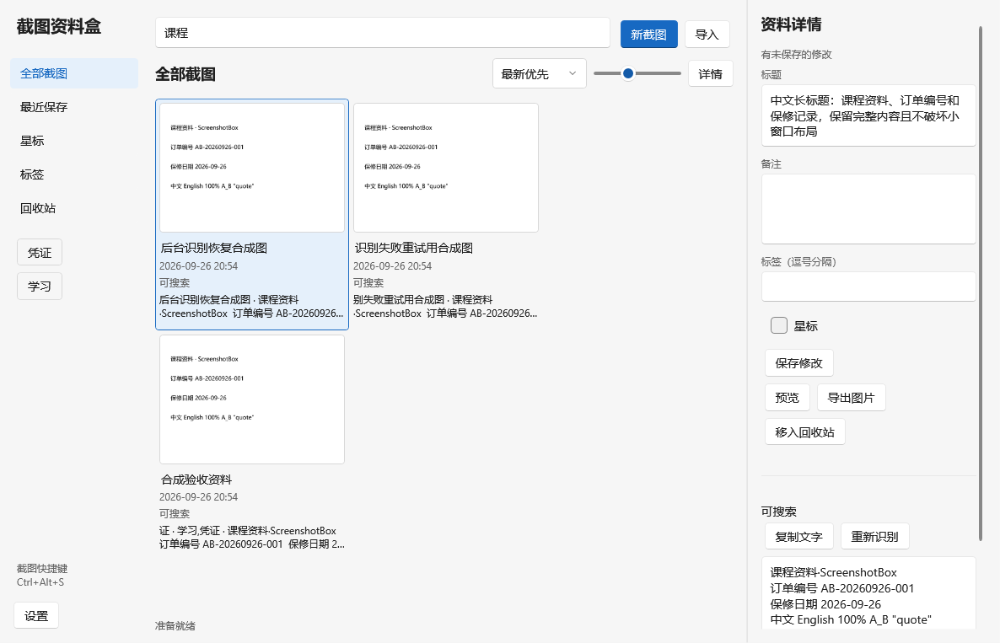

# 截图资料盒 / ScreenshotBox

Windows本地截图资料库：组合快捷键 → 拖动框选 → 选区与标注 → 保存并复制 → 后台中文OCR → 关键词找回。

适用 Windows 11 x64，C# / .NET 10 / WPF。CPU运行，不需要账号、API密钥、Python、CUDA或显卡。应用代码MIT开源；上游组件和模型保留各自许可证。

实际运行界面，使用合成资料展示：



## 使用

解压发行ZIP后双击 `ScreenshotBox.exe`，或运行用户级setup.exe并选择安装目录。完整发行目录包含运行时、原生库和中文模型，不要只复制exe。所有数据默认保存在 `%LOCALAPPDATA%\ScreenshotBox\library`，与安装位置无关。设置中的“更改保存位置并迁移资料”可以选择自定义目录，自动迁移已有图片、文字和分类后重启。

默认快捷键 `Ctrl+Alt+S`。在设置中录入新的组合键，例如 `Alt+A` 或 `Ctrl+Shift+Q`。系统保留或已被其他应用注册的组合不能覆盖，修改失败时保留旧组合。

拖动框选后可以移动选区、拖八个调整点，使用画笔、箭头、矩形、橡皮或马赛克。六种快捷颜色之外，可用 RGB 滑条和 Hex 色值自定义颜色；画笔和形状线宽1–32px、橡皮4–80px、马赛克块6–32px。橡皮恢复原图像素；`Ctrl+Z` 撤销、`Ctrl+Y` 重做，清除标注也能撤销。`Enter` 保存并复制，`Esc` 取消；也可以仅复制或另存PNG。图片先保存，OCR在后台识别最终输出图像。

Ctrl+F定位搜索框。资料库支持PNG/JPEG拖入或批量导入、标题、备注、逗号分隔标签、星标、回收站恢复、原图预览和导出。空格预览选中图片；Ctrl+滚轮缩放，鼠标拖动平移。搜索匹配OCR整行时在原图高亮整行，跟随缩放和平移。点击“保存修改”或按 Ctrl+S 保存标题/备注/标签改动。未保存状态明确显示；独立编辑窗打开时，该资料的主窗口编辑字段暂停，避免互相覆盖。标签分类按完整标签筛选，能和搜索词组合。

预览中 Ctrl+C 复制图片、Ctrl+0 适应窗口、Ctrl+1 显示实际像素大小；长图的适应比例随窗口变化。缩略图大小、自定义颜色和标注大小会在重启后保留。

关闭主窗口进入托盘；托盘右键可以打开、截图、退出。备份与恢复位于设置；迁移和恢复到新目录后自动重启。彻底退出或处理资料库前，会提示保存、放弃或取消未保存的资料修改。

## 构建

需要 Windows x64 和 .NET SDK 10.0.401（运行发行包不需要SDK）。依赖版本及传递依赖锁定在 `packages.lock.json`。首次构建先取得模型，再运行：

```powershell
pwsh -File scripts/fetch-models.ps1
pwsh -File scripts/build.ps1
pwsh -File scripts/package.ps1 -Version 0.1.2
```

Windows PowerShell 5.1 也可调用上述脚本。命令实际生成包含运行时、CPU ONNX原生库及中文模型的发行目录ZIP。SDK可使用系统安装，也可以仅放在 `.tools/dotnet`。详见 [构建说明](docs/build.md)。

## 验证与说明

GitHub Actions 的 [Windows CI](.github/workflows/windows.yml) 会在推送、拉取请求和手动触发时，用 .NET SDK 10.0.401 按锁文件恢复依赖、编译 Windows x64 App，并运行全部 Core 测试（当前42项）及截图标注的合成像素探针（当前35项）。CI验证编译、核心逻辑和合成图像上的标注/撤销行为，不下载OCR模型、不采集真实桌面、不运行截图界面、不打包或发布发行版，也不需要账号或额外密钥。


- [设计参考和样式](docs/design.md)
- [使用说明](docs/usage.md)
- [架构与学习要点](docs/architecture.md)
- [存储、搜索和恢复约束](docs/storage.md)
- [第三方依赖与模型来源](docs/third-party.md)
- [实际验证记录](docs/validation.md)
- [实际界面截图与迭代自评](docs/ui-review.md)
- [已知限制](docs/limitations.md)

不包含云同步、滚动截图、录屏、翻译或语义检索。不上传图片或文字。用户数据、真实截图、数据库、密钥和构建工具均不进入Git仓库。
