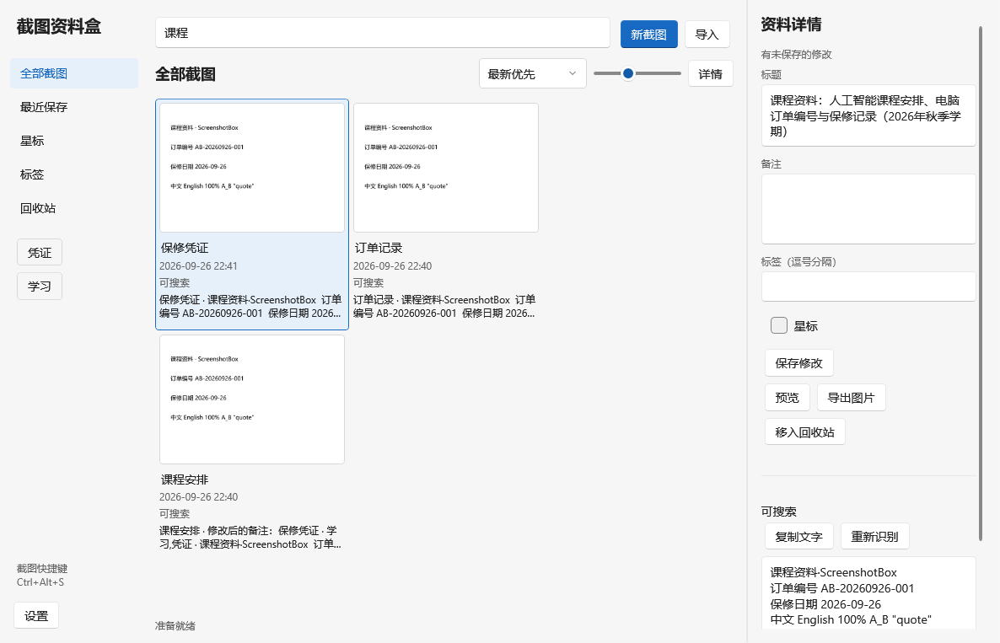
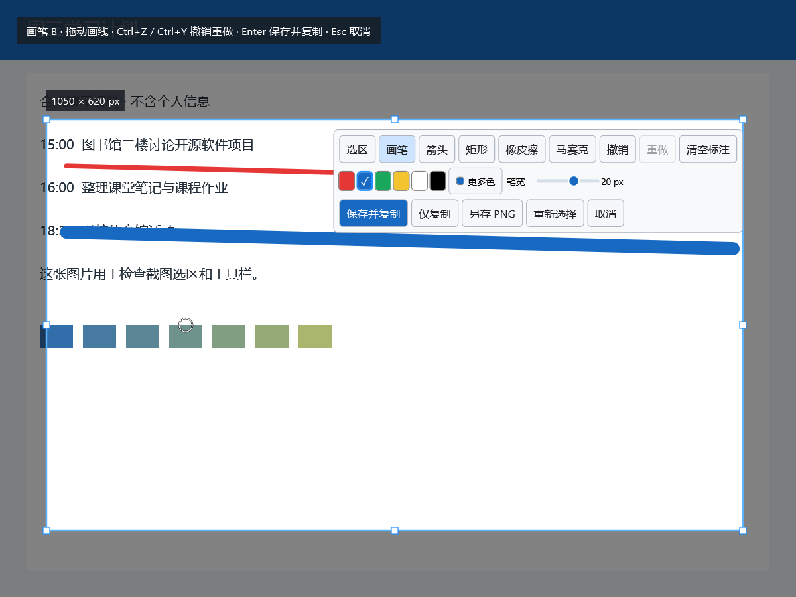
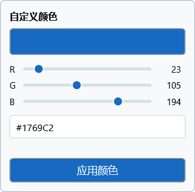
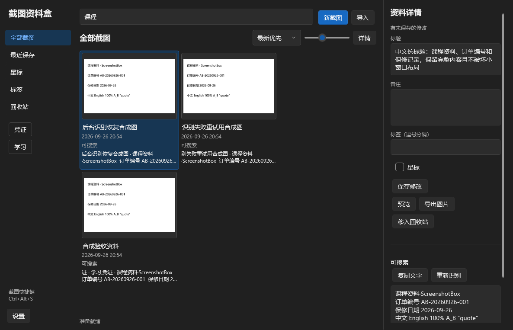

<div align="center">


# 截图资料盒 · ScreenshotBox

**截图保存到本地，按文字找回来。**

简体中文 · [English](README.md)

[](https://github.com/liugedragon/screenshot-box/actions/workflows/windows.yml)
[](https://github.com/liugedragon/screenshot-box/actions/workflows/linux.yml)
[](https://github.com/liugedragon/screenshot-box/releases)
[](LICENSE)

[**下载安装包**](https://github.com/liugedragon/screenshot-box/releases/download/v0.1.4/ScreenshotBox-0.1.4-win-x64-setup.exe) · [**下载 ZIP**](https://github.com/liugedragon/screenshot-box/releases/download/v0.1.4/ScreenshotBox-0.1.4-win-x64.zip) · [使用说明](docs/zh-CN/usage.md) · [反馈问题](https://github.com/liugedragon/screenshot-box/issues/new/choose)

</div>

截图资料盒是桌面截图工具和本地图片资料库。按快捷键框选截图，保存后自动识别文字；以后可以按标题、备注、标签或图片中的文字查找。课程安排、订单编号、保修日期等内容都保存在电脑里。

支持 **Windows 11 x64**，无需账号、API 密钥、Python 或独立显卡。OCR 在本地 CPU 上运行，模型随发行包提供。**0.1.4 为测试版**，已知问题和未验证的使用条件见[已知限制](docs/zh-CN/limitations.md)。



*0.1.3 中文界面，使用合成测试资料。0.1.3 首次启动跟随 Windows 界面语言，设置中可选择跟随系统、简体中文或 English；切换后重启生效。*

## 开始使用

1. 安装后按 **Ctrl+Alt+S**，拖动框选。松开后可移动选区或拖动八个调整点，也可以添加画笔、箭头、矩形或马赛克。
2. 按 **Enter** 保存并复制，然后回到原来的应用。图片立即保存，文字在后台识别。
3. 从托盘打开资料库，输入截图中的关键词。选中图片后按 **空格**预览，匹配的文字行会高亮。

截图快捷键可改为 `Alt+A`、`Ctrl+Shift+Q` 等组合。应用检查常见系统保留组合和全局热键占用；注册失败时保留原快捷键。按 `Esc` 取消截图，不创建图片或记录。

## Ubuntu / X11 试用版

Ubuntu x64 试用版单独发行，支持区域截图、标注、本地中英文 OCR、搜索和资料备份。目前需要 X11，暂不包含托盘和登录自启动。

[下载 Linux 试用版](https://github.com/liugedragon/screenshot-box/releases/download/v0.1.5-linux.1/ScreenshotBox-0.1.5-linux.1-linux-x64.tar.gz) · [Linux 使用说明与验证范围](docs/zh-CN/linux.md)

以下功能介绍以 Windows 版为主，Linux 的差异见单独说明。

## 功能

| 功能 | 说明 |
| --- | --- |
| 截图与复制 | 框选、移动、八点调整；保存并复制、仅复制或另存 PNG。 |
| 标注 | 画笔、箭头、空心矩形、橡皮擦、马赛克；可调大小、RGB/Hex 调色盘、撤销和重做。 |
| 文字搜索 | 搜索标题、备注、标签和 OCR 文字；支持短中文词、中英混排、日期和编号。 |
| 图片整理 | 导入 PNG/JPEG，添加标签、备注和星标；回收站支持恢复。 |
| 原图预览 | 缩放、平移、适应窗口和实际像素大小；OCR 匹配按整行高亮。 |
| 本地资料库 | 可更改保存位置，支持 ZIP 备份与恢复。 |
| 外观与语言 | 系统、浅色、深色主题；跟随系统、简体中文或 English。 |

<details>
<summary>截图工具、调色盘和深色界面</summary>







更多界面见[界面检查记录](docs/zh-CN/ui-review.md)。

</details>

## 安装与数据

- **安装包**：选择安装位置，创建开始菜单和卸载入口。从 0.1.4 起，默认勾选“登录 Windows 后在托盘启动”，安装时可取消。
- **ZIP**：解压完整目录后运行 `ScreenshotBox.exe`，便携运行不添加 Windows 启动项。

两种包都包含 .NET 运行时、原生库和 OCR 模型，请保留完整目录。校验文件见[发行页](https://github.com/liugedragon/screenshot-box/releases/tag/v0.1.4)。升级前请从托盘退出旧版。

安装 0.1.4 后，登录启动安静驻留托盘，截图快捷键可直接使用；从托盘打开资料库。可在“任务管理器 → 启动应用 → ScreenshotBox”禁用或重新启用，应用不更改已禁用的启动状态。

资料默认位于 `%LOCALAPPDATA%\ScreenshotBox\library`，与安装目录分开。在设置中可迁移到其他文件夹，原目录保留。应用不上传图片或文字，识别时不下载模型；卸载保留资料库。关闭主窗口后继续在托盘运行，托盘菜单可彻底退出。

OCR 可能识别错低清晰度、手写或复杂背景中的文字。马赛克是视觉像素化，不提供安全脱敏保证；擦除马赛克会恢复原图。当前没有滚动截图、录屏、云同步、自动更新或保存后的再次标注。应用和安装包未数字签名。测试环境与结果见[验证记录](docs/zh-CN/validation.md)。

## 文档与开发

| 文档 | 内容 |
| --- | --- |
| [使用说明](docs/zh-CN/usage.md) | 截图、标注、搜索、整理、备份和设置。 |
| [构建](docs/zh-CN/build.md) · [打包与安装](docs/zh-CN/distribution.md) | 从源码运行，生成 ZIP 和安装包。 |
| [架构](docs/zh-CN/architecture.md) · [存储与搜索](docs/zh-CN/storage.md) | 坐标、检索、后台任务和数据恢复。 |
| [设计](docs/zh-CN/design.md) · [界面检查](docs/zh-CN/ui-review.md) | 参考来源、样式和布局记录。 |
| [测试](docs/zh-CN/validation.md) · [限制](docs/zh-CN/limitations.md) | 测试结果和使用条件。 |
| [第三方组件](docs/zh-CN/third-party.md) | 组件、模型、版本、许可证和校验值。 |

需要 Windows x64 和 **.NET SDK 10.0.401**。在仓库根目录运行：

```powershell
powershell -ExecutionPolicy Bypass -File scripts/fetch-models.ps1
powershell -ExecutionPolicy Bypass -File scripts/build.ps1
powershell -ExecutionPolicy Bypass -File scripts/package.ps1 -Version 0.1.4
```

首次下载模型需要联网。依赖由 `packages.lock.json` 锁定，安装包构建需要 Inno Setup。

问题报告、文档修正和代码贡献见 [CONTRIBUTING](CONTRIBUTING.zh-CN.md)，计划功能见 [ROADMAP](ROADMAP.zh-CN.md)。如果软件对你有用，欢迎点个 Star。

## 许可证

应用代码和原创图标采用 [MIT](LICENSE)。WPF UI、RapidOcrNet、PaddleOCR 模型、ONNX Runtime、SQLite 等组件保留各自许可证，见[第三方说明](docs/zh-CN/third-party.md)。界面布局参考 Eagle、ShareX 和 PowerToys，详情见[设计记录](docs/zh-CN/design.md)。
