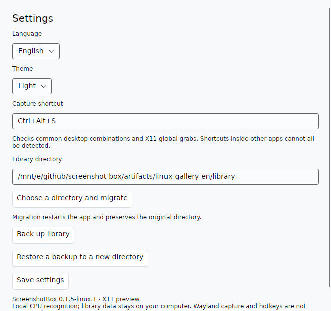
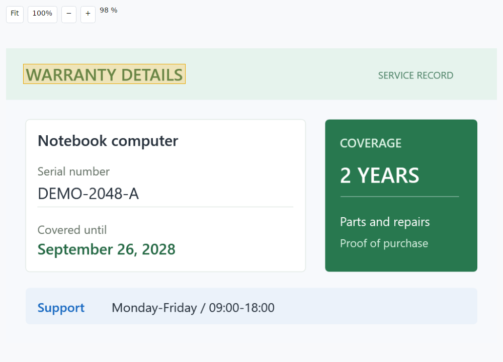

# Ubuntu / Linux preview

English · [简体中文](../zh-CN/linux.md)

ScreenshotBox has an experimental Linux frontend built with Avalonia. Version **0.1.5-linux.1** targets **Ubuntu x64 with an X11 desktop**. It shares the library format, literal search, backup validation and OCR queue with the Windows application.

## What is available

- Select, resize and move a screenshot region. Annotate with pen, arrows, rectangles or mosaic; adjust tool sizes, erase annotations and undo.
- Save and copy, copy only, or export a PNG. Saving starts CPU text recognition in the background.
- Import PNG/JPEG images, edit titles, notes and tags, mark favorites, and use the app's trash and restore views.
- Search titles, notes, tags and image text, including two-character Chinese terms. Preview an original image with zoom, panning and matching OCR line highlights.
- Use light, dark or system theme. Follow the system language or choose Simplified Chinese / English in Settings.
- Back up the library, restore to an empty directory, or move it to a chosen directory. The original directory remains after migration.

The Linux preview does not include a tray icon or automatic login startup. Closing its library window exits the application. After a capture, the library remains available as a window.

## Run a release

Get the Linux `.tar.gz` from [Releases](https://github.com/liugedragon/screenshot-box/releases). The package includes .NET, the Chinese OCR models and native libraries; using it does not require the SDK, Python or CUDA.

```bash
sha256sum -c ScreenshotBox-0.1.5-linux.1-linux-x64.sha256
tar -xzf ScreenshotBox-0.1.5-linux.1-linux-x64.tar.gz
cd ScreenshotBox-0.1.5-linux.1-linux-x64
./ScreenshotBox.Linux
```

An X11 display must be available. On an Ubuntu login screen, select an Xorg session if your desktop offers one. Screenshot capture and global shortcuts are disabled in a Wayland session; importing and searching existing images remain available.

The package requires normal Linux desktop libraries, including X11, fontconfig, ICU, OpenSSL and the C/C++ runtime. It has been exercised on Ubuntu 20.04.3 with glibc 2.31. A missing library error can be investigated with:

```bash
ldd ./ScreenshotBox.Linux
ldd ./libSkiaSharp.so
ldd ./libHarfBuzzSharp.so
ldd ./libonnxruntime.so
ldd ./libe_sqlite3.so
```

## Install for the current user

From the extracted release directory:

```bash
./installer/linux/install.sh
```

The default install location is `~/.local/opt/ScreenshotBox`. The installer adds a desktop menu entry for the current user. To choose another location:

```bash
./installer/linux/install.sh --prefix "$HOME/Applications/ScreenshotBox"
```

For the default installation, run `~/.local/opt/ScreenshotBox/installer/linux/uninstall.sh`. For a custom location, uninstall with the matching path:

```bash
./installer/linux/uninstall.sh --prefix "$HOME/Applications/ScreenshotBox"
```

Uninstall removes the application and its menu entry. The library and settings are preserved. The Linux installer does not add a login startup entry.

## Storage and settings

| Item | Default location |
| --- | --- |
| Images, thumbnails and database | `$XDG_DATA_HOME/ScreenshotBox/library`, or `~/.local/share/ScreenshotBox/library` |
| Settings | `$XDG_CONFIG_HOME/ScreenshotBox/settings.json`, or `~/.config/ScreenshotBox/settings.json` |

Change the library directory in Settings. A migration or language change restarts the application. The same backup format works across the Linux and Windows frontends; restore into a new empty directory.

With language set to **Follow system**, the app checks `LC_ALL`, `LC_MESSAGES`, then `LANG`. Chinese locales use Simplified Chinese; other locales use English. The **Follow system** label is translated with the rest of the interface.

The default capture shortcut is `Ctrl+Alt+S`. Settings accepts combinations such as `Alt+A`. The application checks common desktop-reserved combinations and actual X11 global key grabs. Shortcuts used only inside another application cannot all be detected. A failed registration keeps the previous working shortcut.

## WSL and XLaunch

WSL can run the Linux binary and display its windows through XLaunch/VcXsrv. Configure `DISPLAY` for your running X server and permit that connection in the Windows firewall. The correct address depends on your WSL network configuration; do not assume that every installation uses the same address.

The X11 capture backend captures the X server's desktop. **It does not capture the Windows desktop or Windows application windows.** An X11 shortcut also requires key events reaching that X server. Use the Windows release to capture normal Windows applications.

XLaunch is useful for checking the Linux window, capture tools and clipboard components. It does not reproduce an Ubuntu desktop's window manager, tray host, desktop shortcuts or multi-monitor behavior.

## Build and test

Requirements: .NET SDK **10.0.401**, GCC, binutils, curl and Python 3. Chinese text fixtures need a font such as `fonts-noto-cjk`. Fetch the Chinese model and dictionary using the pinned URLs and SHA-256 values in [`models/chinese/sources.json`](../../models/chinese/sources.json).

```bash
python3 scripts/fetch-models.py
bash scripts/build-linux-sqlite.sh
dotnet restore src/ScreenshotBox.Linux/ScreenshotBox.Linux.csproj --locked-mode
dotnet build src/ScreenshotBox.Linux/ScreenshotBox.Linux.csproj --configuration Release --no-restore
bash scripts/package-linux.sh 0.1.5-linux.1
```

Before packaging, build the pinned SQLite 3.53.3 library with [`build-linux-sqlite.sh`](../../scripts/build-linux-sqlite.sh). This replaces the NuGet SQLite binary requiring glibc 2.33 with a source build compatible with the Ubuntu 20.04 baseline. Builds for this baseline must use glibc 2.31 or an equivalent toolchain.

[Linux service checks](../../tests/ScreenshotBox.Linux.Services.Probe/README.md) run actual CPU Chinese OCR, verify line boxes and literal searches, and exercise image writes and backup recovery. Existing Core tests can run on Linux with the compatible SQLite library placed in their `runtimes/linux-x64/native/` output directory before running:

```bash
dotnet restore tests/ScreenshotBox.Core.Tests/ScreenshotBox.Core.Tests.csproj --locked-mode
dotnet build tests/ScreenshotBox.Core.Tests/ScreenshotBox.Core.Tests.csproj --no-restore
cp artifacts/native/linux-x64/libe_sqlite3.so \
  tests/ScreenshotBox.Core.Tests/bin/Debug/net10.0/runtimes/linux-x64/native/libe_sqlite3.so
dotnet test tests/ScreenshotBox.Core.Tests/ScreenshotBox.Core.Tests.csproj --no-build --no-restore
```

## Checks and limits

Checks on **Ubuntu 20.04.3 / WSL, .NET 10.0.12**:

| Scope | Result |
| --- | --- |
| Shared Core tests: geometry, literal Chinese search, metadata, generation races and backup validation | 42 passed |
| Linux services with SkiaSharp 3.119.4 and actual CPU PP-OCRv5 Chinese inference | 41 passed |
| Linux capture component checks | 42 passed |
| App components: English light and Chinese dark, native clipboard, second launch, edit focus, real 760 DIP window | 20 passed in each language |
| User-only installer transactions, ownership, rollback and uninstall | 19 passed |
| SQLite 3.53.3 source build | Exact source ID and source checksums verified; FTS5, JSON, math, R-tree and required exports passed; maximum required glibc 2.29 |
| Shared OCR extraction, Windows WPF Release build | Passed with no warnings or errors |

Records: [capture](../test-results/linux-0.1.5-linux.1/capture.json), [services](../test-results/linux-0.1.5-linux.1/services.json), [English app](../test-results/linux-0.1.5-linux.1/app-en.json), [Chinese app](../test-results/linux-0.1.5-linux.1/app-zh.json) and [installer](../test-results/linux-0.1.5-linux.1/installer.json). These records use synthetic data; workspace paths have been replaced with a placeholder.

The service OCR fixture produced five line boxes. Image-only searches found `课程`, `订单`, `保修`, `B204`, `English` and `2026-09-27`. These are programmatic component and integration checks. They do not establish that every desktop shortcut, compositor or clipboard destination works.

Wayland capture and portal-based shortcuts are not implemented. Mixed-DPI multi-monitor capture, physical Ubuntu desktop sessions, manual image pastes into common Linux applications and a disconnected fresh machine without developer tools have not been verified. OCR can misread text; highlights follow whole recognized lines. The Linux preview should be evaluated separately from the Windows release.

See [third-party software and models](third-party.md) for component versions, original license texts and model provenance.

## Interface






These are client-area renders of the running native application, using six synthetic English sample images. Their OCR results contain 79 line boxes.
